# Kế Hoạch Tái Cấu Trúc Luồng Đặt Hàng & Thanh Toán (Order & Checkout Flow)

Qua việc phân tích mã nguồn hệ thống (cả Backend lambda services và Frontend Next.js app), luồng đặt hàng hiện tại **CHƯA ỔN** và đang tồn tại một số **lỗi nghiêm trọng (Critical Bugs)** ảnh hưởng trực tiếp đến tính đúng đắn của dữ liệu tồn kho (inventory) cũng như trạng thái đơn hàng.

Dưới đây là báo cáo chi tiết các lỗi hiện tại và kế hoạch sửa đổi.

---

## 1. Các Vấn Đề Nghiêm Trọng Hiện Tại (Critical Issues)

### 🔴 Vấn đề 1: Lệch pha Giữ chỗ & Giải phóng tồn kho (Inventory Reservation Mismatch)
* **Hiện trạng ở [checkout/page.tsx](file:///E:/Project/repo/music-instrument-store/frontend/app/(storefront)/checkout/page.tsx):** Khi khởi tạo thanh toán Stripe hoặc Momo, client gọi API `/api/checkout` (hướng tới [checkout-service/index.ts](file:///E:/Project/repo/music-instrument-store/services/checkout-service/index.ts)) nhưng truyền dữ liệu sản phẩm bị **hardcode**:
  ```typescript
  items: [
    {
      productId: "1", // <-- Bị hardcode cứng ID là "1"
      name: `Thanh toán đơn hàng ${orderId}`,
      price: amount,
      quantity: 1,
    }
  ]
  ```
* **Hiện trạng ở [checkout-service/index.ts](file:///E:/Project/repo/music-instrument-store/services/checkout-service/index.ts):** Thực hiện giữ chỗ tồn kho (Inventory Reservation) bằng cách trừ `stock` và cộng `reserved` của **sản phẩm ID "1"**.
* **Hiện trạng ở Webhook ([payment-webhook/index.ts](file:///E:/Project/repo/music-instrument-store/services/payment-webhook/index.ts) & [stripe/route.ts](file:///E:/Project/repo/music-instrument-store/frontend/app/api/payment-webhook/stripe/route.ts)):** Khi thanh toán thành công, webhook lấy thông tin đơn hàng thực tế từ DB (`ORDER#${orderId}`) và giải phóng giữ chỗ (`reserved = reserved - quantity`) dựa trên các sản phẩm thực tế (ví dụ: `sax-01`, `sax-02`).
* **Hậu quả:**
  1. Sản phẩm thực tế bán ra (`sax-01`) **không bao giờ bị trừ `stock`** ở bước checkout, nhưng lại bị **trừ âm số lượng `reserved`** khi webhook chạy.
  2. Sản phẩm ảo `"1"` bị trừ sạch `stock` và lượng `reserved` tăng vô hạn (rò rỉ tồn kho).

---

### 🔴 Vấn đề 2: Thiếu Cơ Chế Giải Phóng Giữ Chỗ Khi Hủy/Bỏ Quên Thanh Toán (No Reservation Expiry)
* **Hiện trạng:** Khi khách hàng bấm thanh toán Online (Stripe/Momo), tồn kho đã bị trừ ở bước gọi `/checkout`. Nếu khách hàng tắt trình duyệt, hủy giao dịch hoặc thanh toán thất bại:
  * Số lượng `stock` đã trừ và `reserved` đã cộng của sản phẩm ảo `"1"` **không bao giờ được hoàn lại**.
* **Hậu quả:** Thất thoát tồn kho ảo lớn, gây hết hàng giả (Ghost Out-Of-Stock).

---

### 🔴 Vấn đề 3: Luồng COD Có Thể Gây Lỗi Chạy Ngầm & Trôi Đơn
* **Hiện trạng:** Khi chọn thanh toán COD, client gọi `/orders` (đẩy vào SQS). Lambda [order-processing/index.ts](file:///E:/Project/repo/music-instrument-store/services/order-processing/index.ts) xử lý SQS sẽ kiểm tra stock:
  * Nếu hết hàng, lambda sẽ ném ra lỗi `throw stockErr` để SQS thử lại (retry) và cuối cùng rơi vào Dead Letter Queue (DLQ).
* **Hậu quả:** Khách hàng ở frontend đã nhận được thông báo "Đặt hàng thành công" (vì API `/orders` trả về `201 Created` ngay khi đẩy vào SQS). Tuy nhiên, thực tế đơn hàng đã bị thất bại âm thầm trong nền và không bao giờ được ghi vào DB.

---

### 🔴 Vấn đề 4: Phương Thức VNPay Bị Bỏ Quên Trạng Thái Trên DB
* **Hiện trạng:** Khi thanh toán qua VNPay (VietQR), frontend giả lập nút "Xác nhận đã thanh toán" nhưng **không hề gọi webhook** để cập nhật trạng thái đơn hàng trên DynamoDB.
* **Hậu quả:** Đơn hàng VNPay luôn bị kẹt ở trạng thái `PENDING` (Chờ xác nhận) trên Database, dù giao diện client báo thành công.

---

### 🔴 Vấn đề 5: Hardcode thông tin khách hàng khi thanh toán
* **Hiện trạng ở [checkout/page.tsx](file:///E:/Project/repo/music-instrument-store/frontend/app/(storefront)/checkout/page.tsx):** Khi gọi `/api/checkout`, frontend gửi thông tin customer giả lập:
  ```json
  "customer": {
    "name": "Khách Hàng Test",
    "phone": "0912345678",
    "address": "Địa chỉ Test",
    "note": "Test thanh toán Momo"
  }
  ```
  Thông tin này ghi đè lên thông tin khách hàng thực tế đã nhập ở trang giỏ hàng khi gửi lên Stripe/Momo.

---

## 2. Kiến Trúc Luồng Đặt Hàng Chuẩn (Proposed Architecture)

Để giải quyết triệt để các vấn đề trên, chúng ta sẽ cấu trúc lại luồng theo mô hình sau:

```mermaid
sequenceDiagram
    autonumber
    actor Client as Khách hàng (Frontend)
    participant OrderAPI as Order API
    participant DB as DynamoDB
    participant SQS as SQS Queue
    participant OrderProc as Order Processing Lambda
    participant Checkout as Checkout Service (Stripe/Momo)
    participant Webhook as Payment Webhook

    %% Luồng Đặt Đơn COD
    rect rgb(20, 40, 40)
        note right of Client: Luồng COD (Thanh toán khi nhận hàng)
        Client->>OrderAPI: POST /orders (Items, Customer, COD)
        OrderAPI->>DB: TransactWrite (Deduct Stock AND Save Order)
        alt Hết hàng
            DB-->>OrderAPI: Transaction Canceled (Out of stock)
            OrderAPI-->>Client: 400 Bad Request (Hết hàng!)
        else Thành công
            DB-->>OrderAPI: Done
            OrderAPI->>SQS: Push Order Event (for notification)
            OrderAPI-->>Client: 201 Created (Order ID)
        end
    end

    %% Luồng Đặt Đơn Online
    rect rgb(30, 30, 50)
        note right of Client: Luồng Online (Stripe/Momo/VNPay)
        Client->>OrderAPI: POST /orders (Items, Customer, Online)
        OrderAPI->>DB: TransactWrite (Reserve Stock: Stock-, Reserved+ AND Save Order PENDING)
        alt Hết hàng
            DB-->>OrderAPI: Transaction Canceled (Out of stock)
            OrderAPI-->>Client: 400 Bad Request (Hết hàng!)
        else Thành công
            DB-->>OrderAPI: Done
            OrderAPI-->>Client: 201 Created (Order ID, PENDING_PAYMENT)
        end
        
        Client->>Checkout: POST /checkout (orderId, paymentMethod)
        Note over Checkout: Lấy thông tin đơn hàng thực tế từ DB để tạo Payment Link/Intent
        Checkout-->>Client: Trả về clientSecret (Stripe) hoặc payUrl (Momo/VNPay)
        Client->>Client: Thực hiện thanh toán trực tuyến
        
        Webhook->>DB: Nhận kết quả từ Stripe/Momo/VNPay
        Webhook->>DB: Update Order status = "Chờ lấy đơn", reserved = reserved - qty
        Webhook->>SQS: Push Paid Order Event (gửi notification)
    end
```



---

## 3. Kế Hoạch Hành Động Chi Tiết (Action Plan)

Kế hoạch refactor chia làm 4 giai đoạn chính để đảm bảo hệ thống luôn hoạt động ổn định và có thể kiểm thử từng bước.

### Giai đoạn 1: Đồng bộ hóa xử lý Tồn kho & Tạo Đơn tại [order-api/index.ts](file:///E:/Project/repo/music-instrument-store/services/order-api/index.ts)
1. **Kiểm tra và Trừ/Giữ chỗ Tồn kho đồng bộ:**
   * Sử dụng `TransactWriteCommand` ngay trong `order-api` để kiểm tra điều kiện tồn kho (`stock >= quantity`) và cập nhật:
     * **Nếu COD:** Trừ trực tiếp `stock` (`stock = stock - qty`). Ghi nhận đơn hàng với trạng thái `Chờ lấy đơn`.
     * **Nếu Online (Stripe/Momo/VNPay):** Trừ `stock` và cộng `reserved` (`stock = stock - qty, reserved = reserved + qty`). Ghi nhận đơn hàng với trạng thái `PENDING_PAYMENT` và thêm trường `expiresAt` (ví dụ: +15 phút).
   * Trả về lỗi `400 Out of Stock` ngay lập tức cho client nếu giao dịch thất bại.
2. **Loại bỏ logic trừ tồn kho bất đồng bộ trong SQS** của [order-processing/index.ts](file:///E:/Project/repo/music-instrument-store/services/order-processing/index.ts) nhằm tránh tình trạng đơn hàng COD bị trôi hoặc lỗi ngầm.

### Giai đoạn 2: Điều chỉnh [checkout-service/index.ts](file:///E:/Project/repo/music-instrument-store/services/checkout-service/index.ts) & Client
1. **Sử dụng Dữ liệu Đơn Hàng Thật:**
   * Thay vì nhận thông tin `items` và `customer` từ frontend gửi lên (vốn đang bị mock), `checkout-service` sẽ chỉ nhận `orderId` và `paymentMethod`.
   * Lấy thông tin chi tiết đơn hàng trực tiếp từ DynamoDB để lấy danh sách sản phẩm thật, tổng tiền thật, và thông tin khách hàng thật nhằm khởi tạo Stripe PaymentIntent hoặc Momo Link.
   * **Bỏ bước cập nhật tồn kho tại Checkout Service** (vì bước này đã được làm chuẩn ở `order-api`).
2. **Sửa frontend [checkout/page.tsx](file:///E:/Project/repo/music-instrument-store/frontend/app/(storefront)/checkout/page.tsx):**
   * Chỉ truyền `orderId` và `paymentMethod` khi gọi `/api/checkout`. Loại bỏ phần payload mock.

### Giai đoạn 3: Chuẩn hóa Webhook và Hỗ trợ VNPay Webhook Mock
1. **Sửa [payment-webhook/index.ts](file:///E:/Project/repo/music-instrument-store/services/payment-webhook/index.ts) (Backend) & Local Webhooks (Frontend):**
   * Giải phóng giữ chỗ đúng sản phẩm: Trừ `reserved` của các sản phẩm thực tế trong đơn hàng (`reserved = reserved - qty`).
   * Thêm route/logic xử lý webhook cho VNPay (VietQR mock) để khi người dùng nhấn xác nhận thanh toán giả lập, trạng thái đơn hàng trên DynamoDB được cập nhật thành `Chờ lấy đơn` và giải phóng giữ chỗ tương tự Stripe/Momo.

### Giai đoạn 4: Viết Cơ chế Tự động Hủy Đơn/Hoàn Tồn kho Hết hạn (Reservation Cleanup)
1. **Tạo Lambda Cron Job (Reconciliation Service):**
   * Định kỳ (mỗi 5 phút) quét các đơn hàng có trạng thái `PENDING_PAYMENT` và có `expiresAt < hiện tại`.
   * Thực hiện hoàn trả tồn kho: `stock = stock + qty, reserved = reserved - qty`.
   * Chuyển trạng thái đơn hàng sang `CANCELLED` (Đã hủy do hết hạn thanh toán).
