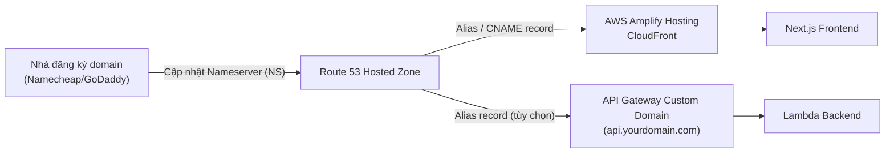

# Hướng Dẫn Cấu Hình Amazon Route 53 Cho Dự Án Music Instrument Store

Tài liệu này hướng dẫn cách trỏ một domain đã mua (ví dụ tại Namecheap, GoDaddy, Tenten...) về **Amazon Route 53**, sau đó gắn domain đó vào **AWS Amplify Hosting** (nơi host [frontend/](file:///E:/Project/repo/music-instrument-store/frontend)) đang được mô tả tại [huong_dan_trien_khai_amplify.md](file:///E:/Project/repo/music-instrument-store/docs/huong_dan_trien_khai_amplify.md).

---

## 1. Lưu Ý Quan Trọng: Route 53 KHÔNG nằm trong AWS Free Tier

Khác với nhiều dịch vụ AWS khác (Lambda, DynamoDB, Cognito... có free tier theo lượt dùng), **Amazon Route 53 tính phí ngay từ ngày đầu tiên**, không có gói miễn phí:

| Khoản phí | Chi phí |
| :--- | :--- |
| Hosted Zone (vùng chứa DNS records của 1 domain) | **$0.50/tháng** cho 25 hosted zone đầu tiên |
| DNS Queries | **$0.40 / 1 triệu lượt truy vấn** (1 tỷ query đầu/tháng) |
| Đăng ký domain mới qua Route 53 (nếu có) | Tùy đuôi domain, ví dụ `.com` ~$9-15/năm (không áp dụng nếu bạn đã mua domain ở nơi khác) |

> [!NOTE]
> Vì domain của bạn đã mua ở nhà đăng ký khác (Namecheap/GoDaddy...), bạn **không** phải trả thêm phí đăng ký domain qua Route 53. Chi phí thực tế chỉ là **~$0.50/tháng** cho 1 hosted zone, cộng thêm vài cent phí query (với lượng truy cập của một cửa hàng nhỏ, thường dưới $1/tháng tổng cộng).
>
> Ngoại lệ duy nhất được miễn phí: một hosted zone bị **xóa trong vòng 12 giờ** kể từ lúc tạo (dùng để test) sẽ không bị tính phí hosted zone (nhưng vẫn tính phí query nếu có).

> [!TIP]
> **Muốn $0 tuyệt đối?** Bạn không bắt buộc phải dùng Route 53. AWS Amplify Domain Management chấp nhận domain được quản lý DNS ở bất kỳ đâu — chỉ cần vào trang quản lý DNS tại nhà đăng ký (Namecheap/GoDaddy) và tự thêm các bản ghi CNAME mà Amplify cung cấp ở [Bước 3](#3-gắn-domain-vào-aws-amplify-hosting), không cần tạo Hosted Zone trên Route 53. Hướng dẫn dưới đây dùng Route 53 vì nó tiện quản lý tập trung cùng các dịch vụ AWS khác (API Gateway custom domain, ACM...) của dự án.

---

## 2. Kiến Trúc Tổng Quan



---

## 3. Bước 1: Tạo Hosted Zone Trong Route 53

### Qua Console
1. Đăng nhập [AWS Console](https://console.aws.amazon.com/) → mở **Route 53**.
2. Vào **Hosted zones** → **Create hosted zone**.
3. Nhập domain của bạn (ví dụ: `my-music-store.com`), loại **Public hosted zone**.
4. Sau khi tạo, Route 53 tự sinh 1 record loại **NS** chứa 4 nameserver, dạng:
   ```
   ns-123.awsdns-45.com
   ns-678.awsdns-90.net
   ns-234.awsdns-56.org
   ns-789.awsdns-01.co.uk
   ```

### Qua AWS CLI (đã cấu hình theo [huong_dan_thiet_lap_moi_truong.md](file:///E:/Project/repo/music-instrument-store/docs/huong_dan_thiet_lap_moi_truong.md))
```bash
aws route53 create-hosted-zone \
  --name my-music-store.com \
  --caller-reference "music-store-$(date +%s)"

# Lấy lại danh sách nameserver để cập nhật ở registrar
aws route53 get-hosted-zone --id <HOSTED_ZONE_ID> --query "DelegationSet.NameServers"
```

---

## 4. Bước 2: Cập Nhật Nameserver Tại Nhà Đăng Ký Domain

1. Đăng nhập vào tài khoản tại nhà đăng ký (Namecheap/GoDaddy/Tenten...).
2. Tìm mục **Nameservers** (hoặc **DNS Management**) của domain.
3. Chọn **Custom DNS** và dán chính xác **4 nameserver** lấy từ Route 53 ở bước trên (bỏ dấu `.` cuối nếu registrar không chấp nhận).
4. Lưu lại. Thời gian lan truyền DNS (propagation) thường mất **vài phút đến 24-48 giờ**.
5. Kiểm tra đã trỏ đúng chưa:
   ```bash
   nslookup -type=NS my-music-store.com
   ```
   Hoặc dùng công cụ [whatsmydns.net](https://www.whatsmydns.net/) để xem trạng thái lan truyền theo từng khu vực.

> [!WARNING]
> Chỉ thay đổi nameserver, **không xóa domain** khỏi nhà đăng ký gốc — bạn vẫn gia hạn (renew) domain ở registrar cũ hàng năm như bình thường. Route 53 lúc này chỉ đóng vai trò "quản lý DNS records", không sở hữu domain.

---

## 5. Bước 3: Gắn Domain Vào AWS Amplify Hosting

1. Vào **AWS Amplify Console** → chọn app frontend của dự án → **App settings > Domain management**.
2. Nhấp **Add domain**, nhập `my-music-store.com`.
3. Vì Hosted Zone đã tồn tại trong cùng tài khoản AWS, Amplify sẽ **tự động phát hiện** và đề xuất tạo sẵn các record cần thiết (Alias/CNAME cho root domain và `www`) — bạn chỉ cần bấm **Save** để xác nhận.
4. Cấu hình mapping nhánh Git ↔ subdomain, ví dụ:
   | Domain/Subdomain | Nhánh Git |
   | :--- | :--- |
   | `my-music-store.com`, `www.my-music-store.com` | `main` |
   | `dev.my-music-store.com` | `dev` |
5. AWS Amplify tự động yêu cầu chứng chỉ SSL miễn phí qua **AWS Certificate Manager (ACM)**, và tự thêm CNAME xác thực (DNS validation) vào Hosted Zone — quá trình cấp chứng chỉ + cập nhật CloudFront thường mất **15-30 phút**.
6. Sau khi trạng thái domain chuyển thành **Available**, truy cập domain để kiểm tra HTTPS hoạt động.

---

## 6. Bước 4 (Tùy Chọn): Custom Domain Cho API Gateway

Nếu muốn API cũng chạy dưới subdomain riêng (ví dụ `api.my-music-store.com`) thay vì URL mặc định dạng `https://xxxxxx.execute-api.<region>.amazonaws.com/prod/`:

1. API `ECommerceApi` trong [infrastructure/lib/backend-stack.ts](file:///E:/Project/repo/music-instrument-store/infrastructure/lib/backend-stack.ts) hiện dùng cấu hình **Edge-optimized** mặc định (không khai báo `endpointConfiguration`) → chứng chỉ ACM cho custom domain loại này **phải nằm ở region `us-east-1`**, bất kể API được deploy ở region nào.
2. Vào **ACM (us-east-1)** → request public certificate cho `api.my-music-store.com` → xác thực qua DNS (ACM có thể tự thêm CNAME vào Hosted Zone nếu bạn bấm **Create records in Route 53** ngay trong console ACM).
3. Vào **API Gateway Console > Custom domain names > Create** → chọn domain `api.my-music-store.com`, gắn certificate vừa tạo, chọn **Edge-optimized**.
4. Tạo **API mapping** trỏ tới stage `prod` của `ECommerceApi`.
5. Trong Route 53 Hosted Zone, tạo record **A (Alias)** trỏ `api.my-music-store.com` → CloudFront distribution mà API Gateway custom domain cung cấp (Alias record với AWS API Gateway **không** bị tính phí query theo bảng giá Route 53).
6. Cập nhật biến môi trường `NEXT_PUBLIC_API_GATEWAY_URL=https://api.my-music-store.com/` trong Amplify Console (Environment variables) rồi **Redeploy** — vì đây là biến `NEXT_PUBLIC_*`, giá trị được build tĩnh vào client code (xem thêm phần "Lỗi 2" trong [huong_dan_trien_khai_amplify.md](file:///E:/Project/repo/music-instrument-store/docs/huong_dan_trien_khai_amplify.md)).

> [!NOTE]
> CORS của `ECommerceApi` hiện đang cấu hình `allowOrigins: apigateway.Cors.ALL_ORIGINS` ([backend-stack.ts:348](file:///E:/Project/repo/music-instrument-store/infrastructure/lib/backend-stack.ts)), nên đổi domain frontend/API sẽ không phát sinh lỗi CORS. Khi lên production thật, cân nhắc giới hạn lại danh sách origin cụ thể thay vì `ALL_ORIGINS` để tăng bảo mật.

---

## 7. Kiểm Soát Chi Phí (Cost Control)

* **Chỉ tạo 1 Hosted Zone cho mỗi domain** — tạo trùng lặp sẽ bị tính phí $0.50/tháng cho mỗi zone thừa.
* Nếu tạo Hosted Zone để thử nghiệm rồi không dùng, hãy **xóa trong vòng 12 giờ** để không bị tính phí tháng đó.
* Ưu tiên dùng **Alias record** (thay vì CNAME thường) khi trỏ vào tài nguyên AWS (Amplify/CloudFront, API Gateway) — Alias record trỏ vào các dịch vụ AWS được liệt kê **không tính phí truy vấn**, còn CNAME thường vẫn bị tính phí query.
* Bật **AWS Budgets** với ngưỡng cảnh báo nhỏ (ví dụ $2/tháng) cho dịch vụ Route 53 để phát hiện sớm nếu có traffic bất thường làm tăng phí query.

---

## 8. Xử Lý Sự Cố Thường Gặp

### Domain chưa nhận diện được sau khi đổi Nameserver
* **Nguyên nhân**: DNS chưa lan truyền xong, hoặc nhập sai/thiếu nameserver ở registrar.
* **Khắc phục**: Chờ thêm (tối đa 48h), kiểm tra lại chính xác 4 nameserver bằng `nslookup -type=NS <domain>` hoặc whatsmydns.net.

### Amplify báo "Certificate pending validation" quá lâu
* **Nguyên nhân**: Record CNAME xác thực ACM chưa được tạo đúng trong Hosted Zone (thường do bạn dùng Hosted Zone khác tài khoản, hoặc xoá nhầm record).
* **Khắc phục**: Vào Route 53 Hosted Zone, kiểm tra record CNAME xác thực do Amplify/ACM tạo có tồn tại và đúng giá trị không; nếu thiếu, vào ACM Console lấy lại giá trị CNAME và tạo thủ công.

### Truy cập domain bị lỗi SSL hoặc "This site can't be reached"
* **Nguyên nhân**: Record A/Alias ở Hosted Zone chưa trỏ đúng vào CloudFront distribution của Amplify, hoặc chứng chỉ SSL chưa cấp xong.
* **Khắc phục**: Kiểm tra trạng thái domain trong Amplify Console (**Domain management**) phải là **Available**; nếu vẫn **Pending**, đợi thêm hoặc kiểm tra lại record trong Hosted Zone.
