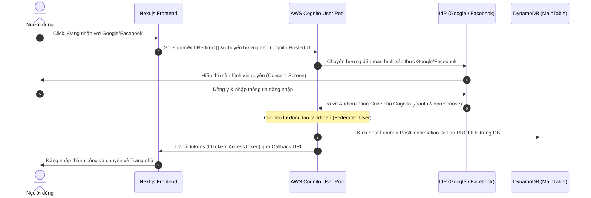

# Hướng dẫn Thiết lập và Tích hợp Đăng nhập Google & Facebook (Cognito & DynamoDB)

Tài liệu này hướng dẫn chi tiết các bước để cấu hình đăng nhập mạng xã hội (Google & Facebook) cho dự án Aureate Forest Boutique sử dụng **AWS Cognito User Pool** và lưu trữ thông tin profile tự động vào **DynamoDB**.

---

## 🗺️ Quy trình Luồng Đăng nhập (OAuth2)



---

## 📋 Bước 1: Lấy thông tin Credentials từ Google & Facebook

### 1.1. Cấu hình Google Login
1. Truy cập [Google Cloud Console](https://console.cloud.google.com/).
2. Tạo/Chọn dự án của bạn.
3. Vào **OAuth consent screen** -> Chọn **External** -> Thiết lập thông tin cơ bản và thêm scope `email`, `profile`, `openid`.
4. Vào **Credentials** -> Click **Create Credentials** -> Chọn **OAuth client ID**:
   - **Application type**: Web application.
   - **Name**: `Music Instrument Store Web`
   - **Authorized JavaScript origins**:
     ```text
     https://music-instrument-store-auth.auth.ap-southeast-1.amazoncognito.com
     ```
   - **Authorized redirect URIs**:
     ```text
     https://music-instrument-store-auth.auth.ap-southeast-1.amazoncognito.com/oauth2/idpresponse
     ```
5. Lưu lại và sao chép **Client ID** và **Client Secret**.

### 1.2. Cấu hình Facebook Login
1. Truy cập [Meta for Developers](https://developers.facebook.com/).
2. Tạo ứng dụng mới -> Chọn loại: **Authenticate and personalize users with Facebook Login**.
3. Vào mục **Thông tin cơ bản (Settings -> Basic)**:
   - **Miền của ứng dụng (App Domains)**:
     ```text
     music-instrument-store-auth.auth.ap-southeast-1.amazoncognito.com
     ```
   - Cuộn xuống dưới cùng click **Thêm nền tảng (Add Platform)** -> Chọn **Trang web (Website)**.
   - Điền **URL trang web (Site URL)**:
     ```text
     https://music-instrument-store-auth.auth.ap-southeast-1.amazoncognito.com
     ```
   - Sao chép **App ID** (Client ID) và **App Secret** (Client Secret).
4. Vào mục **Facebook Login** -> **Cài đặt (Settings)**:
   - Thêm vào ô **URI chuyển hướng OAuth hợp lệ (Valid OAuth Redirect URIs)**:
     ```text
     https://music-instrument-store-auth.auth.ap-southeast-1.amazoncognito.com/oauth2/idpresponse
     ```

---

## ⚙️ Bước 2: Thiết lập cấu hình dự án

### 2.1. File cấu hình môi trường (`frontend/.env.local`)
Khai báo đầy đủ các biến môi trường sau:

```env
# Google & Facebook OAuth Credentials
GOOGLE_CLIENT_ID="YOUR_GOOGLE_CLIENT_ID"
GOOGLE_CLIENT_SECRET="YOUR_GOOGLE_CLIENT_SECRET"
FACEBOOK_CLIENT_ID="YOUR_FACEBOOK_CLIENT_ID"
FACEBOOK_CLIENT_SECRET="YOUR_FACEBOOK_CLIENT_SECRET"

# Cognito Domain Configurations
COGNITO_DOMAIN_PREFIX="music-instrument-store-auth"
NEXT_PUBLIC_COGNITO_DOMAIN="music-instrument-store-auth.auth.ap-southeast-1.amazoncognito.com"

# Redirect URLs cho OAuth Flow (Phải khớp tuyệt đối với cấu hình trong AWS và Google/Facebook Console)
NEXT_PUBLIC_OAUTH_REDIRECT_SIGN_IN="http://localhost:3000/"
NEXT_PUBLIC_OAUTH_REDIRECT_SIGN_OUT="http://localhost:3000/"
```

---

## 💻 Bước 3: Chi tiết các sửa đổi Code

### 3.1. AWS CDK (`infrastructure/lib/auth-stack.ts`)
Đã tích hợp khởi tạo Google Provider, Facebook Provider, Cognito Domain và User Pool Client có ràng buộc dependencies tránh lỗi race condition khi deploy:

```typescript
    // 1d. Tạo Cognito Domain cho Hosted UI (nếu có prefix)
    if (props.cognitoDomainPrefix) {
      this.userPool.addDomain('CognitoDomain', {
        cognitoDomain: {
          domainPrefix: props.cognitoDomainPrefix,
        },
      });
    }

    // 1e. Cấu hình Google Identity Provider (IdP)
    let googleProvider: cognito.UserPoolIdentityProviderGoogle | undefined;
    if (props.googleClientId && props.googleClientSecret) {
      googleProvider = new cognito.UserPoolIdentityProviderGoogle(this, 'GoogleProvider', {
        userPool: this.userPool,
        clientId: props.googleClientId,
        clientSecretValue: cdk.SecretValue.unsafePlainText(props.googleClientSecret),
        attributeMapping: {
          email: cognito.ProviderAttribute.GOOGLE_EMAIL,
          fullname: cognito.ProviderAttribute.GOOGLE_NAME,
          emailVerified: cognito.ProviderAttribute.GOOGLE_EMAIL_VERIFIED, // Quan trọng để tránh lỗi Verify Email
        },
        scopes: ['profile', 'email', 'openid'],
      });
    }

    // 1f. Cấu hình Facebook Identity Provider (IdP)
    let facebookProvider: cognito.UserPoolIdentityProviderFacebook | undefined;
    if (props.facebookClientId && props.facebookClientSecret) {
      facebookProvider = new cognito.UserPoolIdentityProviderFacebook(this, 'FacebookProvider', {
        userPool: this.userPool,
        clientId: props.facebookClientId,
        clientSecret: props.facebookClientSecret,
        attributeMapping: {
          email: cognito.ProviderAttribute.FACEBOOK_EMAIL,
          fullname: cognito.ProviderAttribute.FACEBOOK_NAME,
        },
        scopes: ['public_profile', 'email'],
      });
    }

    // 2. Tạo App Client cho Next.js Frontend
    const supportedProviders = [cognito.UserPoolClientIdentityProvider.COGNITO];
    if (googleProvider) supportedProviders.push(cognito.UserPoolClientIdentityProvider.GOOGLE);
    if (facebookProvider) supportedProviders.push(cognito.UserPoolClientIdentityProvider.FACEBOOK);

    this.userPoolClient = new cognito.UserPoolClient(this, 'MusicStoreUserPoolClient', {
      userPool: this.userPool,
      userPoolClientName: 'WebClient',
      generateSecret: false,
      supportedIdentityProviders: supportedProviders,
      oAuth: props.cognitoDomainPrefix ? {
        callbackUrls: props.callbackUrls || ['http://localhost:3000/'],
        logoutUrls: props.logoutUrls || ['http://localhost:3000/'],
        flows: { authorizationCodeGrant: true },
        scopes: [
          cognito.OAuthScope.EMAIL,
          cognito.OAuthScope.OPENID,
          cognito.OAuthScope.PROFILE,
          cognito.OAuthScope.COGNITO_ADMIN,
        ],
      } : undefined,
    });

    // Thiết lập dependencies để tránh lỗi "Provider does not exist"
    if (googleProvider) this.userPoolClient.node.addDependency(googleProvider);
    if (facebookProvider) this.userPoolClient.node.addDependency(facebookProvider);
```

### 3.2. Cấu hình Amplify Frontend (`frontend/app/components/common/AmplifyConfig.tsx`)
Bổ sung cấu hình `loginWith.oauth` nếu phát hiện có Cognito Domain:

```typescript
      ...(process.env.NEXT_PUBLIC_COGNITO_DOMAIN ? {
        loginWith: {
          oauth: {
            domain: process.env.NEXT_PUBLIC_COGNITO_DOMAIN,
            scopes: ["email", "openid", "profile", "aws.cognito.signin.user.admin"],
            redirectSignIn: [process.env.NEXT_PUBLIC_OAUTH_REDIRECT_SIGN_IN || "http://localhost:3000/"],
            redirectSignOut: [process.env.NEXT_PUBLIC_OAUTH_REDIRECT_SIGN_OUT || "http://localhost:3000/"],
            responseType: "code",
          }
        }
      } : {})
```

### 3.3. Xử lý kịch bản Redirect Hub Listener (`frontend/app/components/nav/AuthNav.tsx`)
AWS Amplify v6 khi chạy redirect đăng nhập sẽ phát ra sự kiện `signInWithRedirect` chứ không phải `signedIn` thông thường. Ta cần cập nhật bộ lắng nghe của `Hub` để bắt kịp sự kiện này:

```typescript
    const unsubscribe = Hub.listen("auth", ({ payload }) => {
      switch (payload.event) {
        case "signedIn":
        case "signInWithRedirect": // Bắt sự kiện chuyển hướng từ Google/Facebook
          init();
          break;
        case "signedOut":
          setUser(null);
          setIsAdmin(false);
          setIsStaff(false);
          break;
      }
    });
```

---

## ⚡ Triển khai và Chạy thử nghiệm
1. Cài đặt các thông số trong file `frontend/.env.local`.
2. Deploy hạ tầng AWS bằng lệnh:
   ```bash
   npm run setup:local
   ```
3. Khởi chạy thử nghiệm cục bộ Frontend:
   ```bash
   npm run dev:web
   ```
4. Truy cập `http://localhost:3000/login` và nhấp chọn đăng nhập bằng Google hoặc Facebook để kiểm nghiệm.

---

## 🔗 Tự động hợp nhất tài khoản theo email (Account Linking)

Từ branch `fix/oauth-account-auto-link`, hệ thống dùng **Cognito PreSignUp trigger** (`services/auth-pre-signup`) để đảm bảo mỗi email chỉ có **một tài khoản duy nhất (một `sub`)** dù đăng nhập bằng email/mật khẩu, Google hay Facebook:

1. **Đã có tài khoản email, lần đầu đăng nhập Google/Facebook (cùng email)**: trigger gọi `AdminLinkProviderForUser` gộp identity federated vào tài khoản có sẵn → giữ nguyên profile, đơn hàng, wishlist.
2. **Chưa có tài khoản, đăng nhập lần đầu bằng Google/Facebook**: trigger tự tạo một tài khoản native "gốc" (mật khẩu ngẫu nhiên, email đã xác thực) rồi liên kết identity federated vào. Muốn đăng nhập bằng email sau này, user chỉ cần dùng **"Quên mật khẩu"** để tự đặt mật khẩu.
3. **Lần liên kết đầu tiên luôn bị Cognito trả về lỗi chứa marker `AUTO_LINKED_RETRY`** (hành vi bắt buộc của pattern này — phải chặn sign-up federated trùng lặp). Frontend (`AmplifyConfig.tsx`) nhận diện marker trong `error_description` và tự động gọi lại `signInWithRedirect` — người dùng không thấy gián đoạn đáng kể.

Lưu ý vận hành:
- **Phải dùng cùng email** giữa các phương thức đăng nhập thì mới tự liên kết được; email khác nhau sẽ tạo tài khoản riêng biệt.
- Tab "Tài khoản liên kết" trong `/profile` giờ liên kết **thật** (redirect OAuth) và hủy liên kết thật (`AdminDisableProviderForUser` qua `POST /users/profile/unlink-provider`), không còn là cờ lưu trong DynamoDB.
- Các user federated **cũ** (tạo trước khi có trigger, username dạng `google_...`) vẫn là tài khoản riêng; trigger không gộp ngược. Nếu cần, xoá user federated cũ trong Cognito Console — lần đăng nhập Google kế tiếp sẽ tự liên kết vào tài khoản email cùng địa chỉ.
