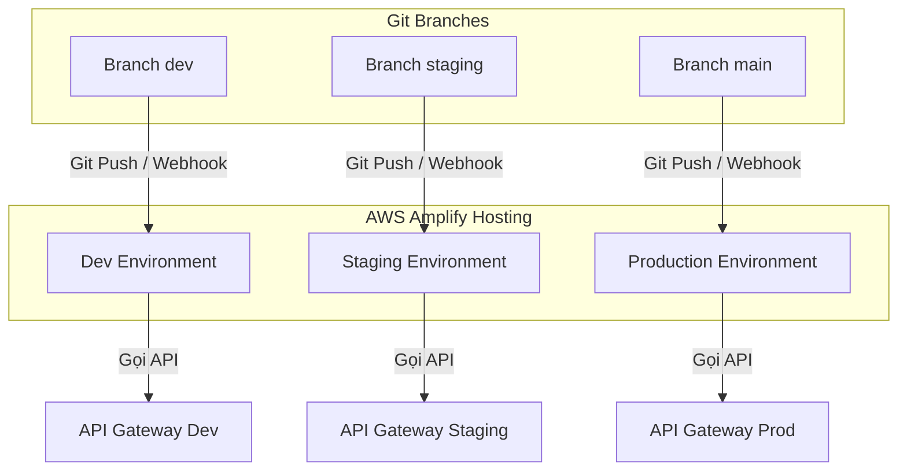

# Hướng Dẫn Triển Khai Next.js Frontend Lên AWS Amplify

Tài liệu này hướng dẫn chi tiết cách cấu hình và triển khai ứng dụng Next.js (thư mục [frontend/](file:///E:/Project/repo/music-instrument-store/frontend)) lên **AWS Amplify Hosting** trong cấu trúc Monorepo của dự án **Music Instrument Store**.

---

## 1. Tổng Quan Kiến Trúc Triển Khai (Deployment Overview)

Dự án sử dụng mô hình **Monorepo** được quản lý bằng **npm workspaces**:
*   **Backend & Infrastructure**: Được định nghĩa bằng AWS CDK ở thư mục [infrastructure/](file:///E:/Project/repo/music-instrument-store/infrastructure), chạy các Lambda functions tại [services/](file:///E:/Project/repo/music-instrument-store/services) và lưu trữ dữ liệu tại DynamoDB/S3.
*   **Frontend (Next.js)**: Nằm ở thư mục [frontend/](file:///E:/Project/repo/music-instrument-store/frontend). Đây là phần sẽ được triển khai lên **AWS Amplify Hosting** để tận dụng các tính năng tự động CI/CD từ GitHub, hỗ trợ SSR (Server-Side Rendering) thông qua AWS Amplify Compute (Next.js App Router).



---

## 2. Các Bước Triển Khai Chi Tiết (Step-by-Step Deployment)

### Bước 1: Deploy Hạ Tầng Backend (AWS CDK)
Trước khi đưa Frontend lên Amplify, bạn **bắt buộc** phải triển khai hạ tầng AWS Backend trước. Điều này đảm bảo bạn có đầy đủ các thông tin endpoint và ID của Cognito/API Gateway để cấu hình cho Frontend.

1. Làm theo hướng dẫn tại [huong_dan_thiet_lap_moi_truong.md](file:///E:/Project/repo/music-instrument-store/docs/huong_dan_thiet_lap_moi_truong.md) để cài đặt AWS CLI và chạy deploy backend stacks:
   ```bash
   npm run setup:local
   ```
2. Ghi lại các giá trị đầu ra (outputs) xuất hiện trong file [frontend/cdk-outputs.json](file:///E:/Project/repo/music-instrument-store/frontend/cdk-outputs.json) hoặc trong console để nhập vào AWS Amplify ở các bước sau.

---

### Bước 2: Kết Nối Repository Với AWS Amplify Hosting
Để thiết lập các môi trường phát triển, tiền phát hành và chạy thực tế đồng nhất, ta sẽ kết nối 3 nhánh chính (`dev`, `staging`, `main`) tương ứng với các môi trường trên AWS Amplify:

1. Đăng nhập vào [AWS Management Console](https://console.aws.amazon.com/).
2. Mở dịch vụ **AWS Amplify**.
3. Nhấp vào nút **Create new app** hoặc **Host web app**.
4. Chọn nhà cung cấp Git của bạn (ví dụ: **GitHub**) và cấp quyền truy cập cho AWS Amplify.
5. Chọn đúng repository chứa dự án **music-instrument-store** và nhánh cần deploy:
   - **Môi trường Dev**: Chọn nhánh `dev`.
   - **Môi trường Staging**: Chọn nhánh `staging`.
   - **Môi trường Production**: Chọn nhánh `main`.
6. Để kết nối thêm một nhánh mới (ví dụ nhánh `staging` khi đã có app):
   - Vào ứng dụng Amplify hiện có trên bảng điều khiển.
   - Nhấp vào nút **Connect branch** ở phía trên bên phải.
   - Chọn nhánh `staging` rồi nhấn Next để hoàn tất liên kết môi trường.

---

### Bước 3: Cấu Hình Monorepo (App Settings)
Vì dự án của chúng ta là một **Monorepo**, AWS Amplify cần được thông báo về thư mục chứa ứng dụng Frontend.

1. Trong giao diện cấu hình Amplify, tick chọn **My app is a monorepo** (hoặc Amplify tự động phát hiện).
2. Điền đường dẫn của Frontend root:
   *   **Monorepo directory**: `frontend`
3. AWS Amplify sẽ tự động tải cấu hình build từ tệp [amplify.yml](file:///E:/Project/repo/music-instrument-store/amplify.yml) ở thư mục gốc của dự án.

> [!NOTE]
> File [amplify.yml](file:///E:/Project/repo/music-instrument-store/amplify.yml) đã được cấu hình sẵn để di chuyển từ thư mục con ra ngoài thư mục gốc (`cd ../..`), chạy lệnh cài đặt thư viện chung (`npm ci`) và build package web (`npm run build -w @music-store/web`).

---

### Bước 4: Cấu Hình Biến Môi Trường (Environment Variables)
Next.js sử dụng cơ chế tĩnh hóa một số biến môi trường bắt đầu bằng tiền tố `NEXT_PUBLIC_` vào mã nguồn client-side tại thời điểm build (build-time). Vì vậy, các biến này **phải được khai báo trên AWS Amplify Console trước khi quá trình build bắt đầu**.

1. Tại bước **Configure build settings** trong Amplify Console (hoặc sau khi tạo app, điền tại mục **App settings > Environment variables**).
2. Thêm các biến môi trường sau (dựa trên tệp [.env.example](file:///E:/Project/repo/music-instrument-store/frontend/.env.example)):

| Tên biến môi trường | Mô tả / Giá trị |
| :--- | :--- |
| `AMPLIFY_MONOREPO_APP_ROOT` | **frontend** (Bắt buộc cho monorepo build) |
| `NEXT_PUBLIC_API_GATEWAY_URL` | Endpoint của API Gateway (ví dụ: `https://xxxxxx.execute-api.ap-southeast-1.amazonaws.com/prod/`) |
| `NEXT_PUBLIC_COGNITO_USER_POOL_ID` | ID của Cognito User Pool (ví dụ: `ap-southeast-1_xxxxxxxxx`) |
| `NEXT_PUBLIC_COGNITO_CLIENT_ID` | Client ID của Cognito App Client |
| `NEXT_PUBLIC_STRIPE_PUBLISHABLE_KEY` | Publishable Key lấy từ Stripe Developer Dashboard |
| `AWS_REGION` | Khu vực AWS nơi bạn deploy Lex Bot & Cognito (ví dụ: `ap-southeast-1`) |
| `AWS_ACCESS_KEY_ID` | Access Key của IAM User có quyền gọi Amazon Lex |
| `AWS_SECRET_ACCESS_KEY` | Secret Access Key tương ứng của IAM User |
| `LEX_BOT_ID` | ID của chatbot Amazon Lex |
| `LEX_BOT_ALIAS_ID` | Alias ID của Lex Bot |

> [!WARNING]
> Tuyệt đối không commit các file chứa key thật (như `.env.local`) lên Github. Chỉ cấu hình thông qua AWS Amplify Dashboard an toàn.

> [!TIP]
> **Cấu hình biến môi trường theo từng nhánh (Branch Override)**:
> AWS Amplify cho phép bạn ghi đè (override) biến môi trường cụ thể cho từng nhánh. Trong phần **Environment variables**, bạn có thể bấm **Manage variables** -> **Add variable overrides**, chọn nhánh `staging` hoặc `main` để khai báo các Key API Gateway, Cognito, Stripe dành riêng cho từng môi trường (ví dụ sử dụng Stripe Production Key cho nhánh `main` và Stripe Test Key cho nhánh `staging`/`dev`).

---

### Bước 5: Kích Hoạt Triển Khai (Deploy)
1. Bấm **Save and deploy**.
2. AWS Amplify sẽ tự động kích hoạt một luồng build (Build pipeline) bao gồm:
   - **Provision**: Khởi tạo container build chuyên dụng hỗ trợ Node.js.
   - **Build**: Tải repo, cài đặt dependencies và build Next.js.
   - **Deploy**: Triển khai mã nguồn đã build lên CloudFront CDN toàn cầu.
   - **Verify**: Kiểm tra trang web hoạt động bình thường.
3. Khi quá trình thành công, Amplify sẽ cung cấp cho bạn một URL mặc định dạng `https://xxxx.amplifyapp.com`. Bạn có thể truy cập để kiểm thử.

---

## 3. Phân Tích File Cấu Hình Build [amplify.yml](file:///E:/Project/repo/music-instrument-store/amplify.yml)

Cấu hình build của chúng ta hoạt động như sau:

```yaml
version: 1
applications:
  - appRoot: frontend
    env:
      variables:
        AMPLIFY_MONOREPO_APP_ROOT: frontend
    frontend:
      phases:
        preBuild:
          commands:
            - cd ../..
            - npm ci
        build:
          commands:
            - npm run build -w @music-store/web
      artifacts:
        baseDirectory: .next
        files:
          - '**/*'
      cache:
        paths:
          - node_modules/**/*
          - frontend/.next/cache/**/*
```

*   `appRoot: frontend`: Khai báo với Amplify rằng ứng dụng cần host nằm tại thư mục `frontend`.
*   `cd ../..`: Mặc định Amplify chạy build tại thư mục `appRoot`. Lệnh này giúp di chuyển ngược lại thư mục gốc của monorepo nhằm chạy được lệnh cài đặt dependencies chung.
*   `npm ci`: Thực hiện cài đặt sạch sẽ tất cả dependencies của toàn bộ dự án dựa trên file [package-lock.json](file:///E:/Project/repo/music-instrument-store/package-lock.json).
*   `npm run build -w @music-store/web`: Sử dụng tính năng workspaces của npm để build ứng dụng Next.js `@music-store/web` (định nghĩa tại [frontend/package.json](file:///E:/Project/repo/music-instrument-store/frontend/package.json)).
*   `baseDirectory: .next`: Amplify sẽ tìm gói build đầu ra Next.js trong thư mục này để đưa lên CDN hosting.
*   `cache/paths`: Lưu trữ `node_modules` và cache của Next.js `.next/cache` để giảm thời gian build cho các lần deploy tiếp theo.

---

## 4. Cấu Hình Custom Domains & SSL (Tùy chọn)

Nếu bạn muốn liên kết trang web với domain riêng (ví dụ: `my-music-store.com`):
1. Trong AWS Amplify Console, chọn ứng dụng của bạn, đi đến mục **App settings > Domain management**.
2. Nhấp vào **Add domain**.
3. Nhập domain của bạn và thiết lập bản ghi DNS theo hướng dẫn của AWS.
4. AWS Amplify sẽ tự động tạo và quản lý chứng chỉ bảo mật SSL (HTTPS) miễn phí thông qua AWS Certificate Manager (ACM).

---

## 5. Xử Lý Sự Cố Thường Gặp (Troubleshooting)

### Lỗi 1: Build fail ở bước `npm ci` do không tìm thấy package-lock.json hoặc workspace dependencies
*   **Nguyên nhân**: Quá trình chuyển thư mục build chưa đúng hoặc không tìm thấy file package-lock.json ở root.
*   **Khắc phục**: Đảm bảo tệp [amplify.yml](file:///E:/Project/repo/music-instrument-store/amplify.yml) có lệnh `cd ../..` trước lệnh `npm ci`. Đồng thời, kiểm tra xem bạn đã commit file [package-lock.json](file:///E:/Project/repo/music-instrument-store/package-lock.json) ở thư mục gốc của repository lên Git chưa.

### Lỗi 2: Biến môi trường hiển thị `undefined` hoặc gọi API thất bại ở phía Client
*   **Nguyên nhân**: Các biến môi trường của Next.js cần được compile tĩnh tại build-time. Nếu bạn thêm biến môi trường trên Amplify Console *sau* khi app đã build xong, các biến đó sẽ không được đưa vào client code.
*   **Khắc phục**: Thêm các biến môi trường bắt đầu bằng `NEXT_PUBLIC_` vào mục **Environment variables** trong Amplify Console, sau đó bấm **Redeploy version** để build lại mã nguồn.

### Lỗi 3: Lỗi CORS khi gọi API Gateway
*   **Nguyên nhân**: Khi deploy lên Amplify, ứng dụng của bạn sẽ có tên miền mới (ví dụ: `https://main.xxxx.amplifyapp.com`). API Gateway được deploy từ CDK mặc định có thể giới hạn CORS hoặc chỉ cho phép local dev.
*   **Khắc phục**: 
    1. Truy cập vào file cấu hình API Gateway trong CDK (như ở [infrastructure/](file:///E:/Project/repo/music-instrument-store/infrastructure)) hoặc cập nhật cấu hình API Gateway để chấp nhận tên miền của Amplify Hosting làm Allowed Origin.
    2. Thực hiện deploy lại CDK stack bằng cách chạy `npx cdk deploy --all` hoặc đẩy code để CI/CD tự chạy.
